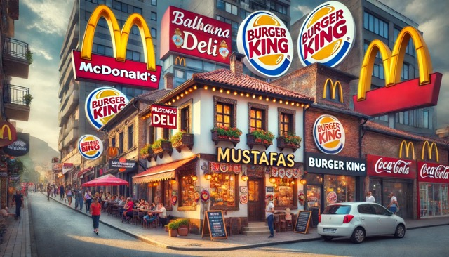
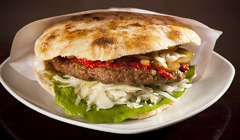
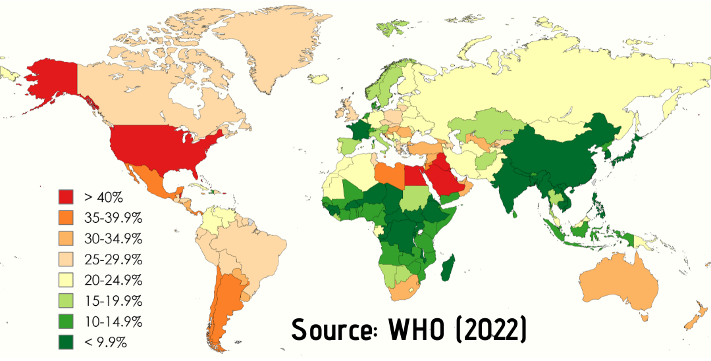

+++
title = "David gegen Goliath – Wie Mustafas Balkan-Läden gegen die Fastfood-Giganten Ankämpfen"
date = "2024-06-17"
draft = false
pinned = false
image = "1ad7536a-7672-4fdc-9428-1914700c7ecc-medium.jpeg"
description = "Bern scheint von McDonalds und Co überflutet zu sein. Fluch oder Segen für die Berner Landwirte? Und wie überlebt ein traditioneller Grill in einer solchen Umgebung? "
footnotes = "Titelbild: ChatGPT- Prompt: generate me a picture for the following title: David gegen Goliath – Wie Mustafas Balkan-Läden gegen die Fastfood-Giganten Ankämpfen\n\nQuellen: \n\nWikipedia- https://de.wikipedia.org/wiki/Liste_der_L%C3%A4nder_nach_Anteil_an_adip%C3%B6sen_Personen\n\n20 Minuten- https://www.20min.ch/story/es-ist-einfach-nur-grusig-l-d-20-biss-bei-mcdonalds-in-schimmligen-burger-846851296012\n\nLen Foley- The World's First Bionic Burger- https://www.youtube.com/watch?v=mYyDXH1amic\n\nWatson- https://politik.watson.de/international/essen/417107002-eine-studie-weist-faekal-bakterien-auf-mcdonalds-automaten-nach\n\n\n\nHerzlichen Dank an Mustafa Sabotic und sein Team"
+++
*Bern scheint von McDonalds und Co überflutet zu sein. Fluch oder Segen für die Berner Landwirte? Und wie überlebt ein traditioneller Grill in einer solchen Umgebung?* 

Mustafa Sabotic ist Imperator. Sein Imperium: Die grösste Kette von balkanischen Läden in der Schweiz. Schon seit den 90ern regiert er mit eiserner Hand, doch sind seine Tage gezählt? Er erzählt uns über sein Geschäft und über die Herausforderungen, die er hat(te).

**Vom ersten Laden zur Expansion**

Mustafa, ethnisch gesehen Bosnier, wuchs in der Schweiz auf und eröffnete 1995 seinen ersten Laden in Biel. Zwei Jahre später folgte die zweite Filiale in Bern und ein Jahr später die Dritte und Letzte in Renens. Mittlerweile übernehmen seine drei Söhne langsam, aber sicher, das Geschäft. Neben zahlreichen Sorten von Käse und Fleisch, welche man woanders nur schwer in die Hände bekommt, verkauft er auch Gewürze und Süssigkeiten von der europäischen Halbinsel. In der Berner Filiale hat es auch einen Grill, wo man Pljeskavica, die ex-Jugoslawische Version des Döners, kaufen kann.

**Ein Mitarbeiter im Interview**

Milan studiert Theaterwissenschaften an der Uni Bern. Nach den Vorlesungen hilft er bei Mustafa im Laden aus. „*Es ist eine super Gelegenheit, etwas dazuzuverdienen,*“ meint Milan. Er ist Schweizer, aber hat balkanische Wurzeln, was die Arbeit deutlich leichter macht. Er kennt die Kultur und kann die Sprache sprechen. Arbeiten tut er jetzt schon ein knappes Jahr im Laden. Ein Leben lang dort angestellt zu sein, kann er sich aber nicht vorstellen. Sein Traum ist es, nach New York zu ziehen und an der berühmt-berüchtigten Juilliard School zu studieren. Aus seiner Sicht der Dinge stellt der Mangel an jungen Kunden das grösste Problem dar. Die meisten Kunden seien schon längst über 30, schätzt er. Laut Milan hat „*Der Laden den Trend rund um die Digitalisierung verpasst und Seiten wie balkani.ch oder balkanking.ch dominieren da den Markt*.“ Die jungen Kunden kaufen dann digital ein und besuchen nicht den Laden, was sich langfristig gesehen ein Problem für Mustafa und seine Söhne darstellt, wenn sie nicht anfangen, online zu verkaufen und attraktiver für die neue Generation zu werden.

")

**Die goldenen Jahre und die Veränderung der Demografie**

Mustafa erzählte uns, wie sich die Gesichter, die der Laden sah, änderten. Anfangs, als im damaligen Jugoslawien der Bürgerkrieg tobte und die ersten Migrationswellen die Schweiz erreichten, florierte das Geschäft und war voller „*Jugos*“. Während dieser Zeit eröffnete auch der Grill in Bern und in den Mittagspausen kamen immer viele Leute auf eine Pljeskavica, ganz wie in der Heimat, vorbei. „*Es war sehr schön zu sehen, wie die Leute freundlich und respektvoll waren, obwohl Ihre Völker sich bekämpften."*

> *Während das Alte Jugoslawien zusammenbrach, wuchs in meinem Laden ein kleines Neues*.

Erzählt uns der Ladenbesitzer schmunzelnd. Die Demografie in den Läden hat sich mittlerweile aber geändert. Weiterhin, so Mustafa, seien die meisten Kunden vom Balkan, aber es gäbe auch Schweizer und Westeuropäer, die regelmässig vorbeischauten, um vor allem Gewürze und Trockenware einzukaufen. Dafür sind die südlichen Regionen Europas schliesslich bekannt.

**Der Kampf gegen die Vorurteile**

Der Grill in Bern dagegen verlor an Beliebtheit und hat heutzutage nur noch am Wochenende offen. Als Grund dafür sieht Mustafa die vergleichsweise hohen Preise. Für eine Pljeskavica und ein Getränk muss man 15 CHF blechen. Einen BigMac oder Döner kann man dagegen schon für rund 8 CHF bei der Konkurrenz erwerben. Am Preis seines Produktes kann er nichts ändern, meint Sabotic, denn im Vergleich zu den, wie er sie nennt, fettigen Fastfood-Ketten kauft er nur geringe Fleischmengen ein. Auch sei sein Fleisch von bester Qualität, anders als die „*Mini-Pallets*“ bei McDonalds. Auf die Frage, wie denn dann ein Döner 8 CHF kosten kann, wusste Mustafa auch keine Antwort. „*Geldwäsche vom Feinsten*“ ist seine Vermutung. Inwiefern er Recht hat, wissen wohl nur die Budenbesitzer. Ein weiteres Problem sieht der Familienvater beim Thema Hygiene. „*Die Kunden hören Geschichten von Salmonellen in Dönerbuden oder Freunden, die sich am Döner den Magen verdorben haben, und denken, es trifft auf jegliche Buden wie die unsere zu, obwohl der Schweizer Fleisch-Fachverband (SFF) unsere Hygienemassnahmen zertifiziert hat.*“\
Ein zufälliger Passant, den wir befragt haben, bestätigt Mustafas These. Er selbst hat noch nie Döner, Pljeskavica und Co. probiert – hat es aber auch nicht vor, weil ebensolche Geschichten über schlechte Hygieneumgebungen ihn abschrecken. Auf die Frage, was er isst, wenn es mal schnell gehen muss, meinte er, dass er am liebsten zu McDonalds oder KFC geht, denn „*dort ist es wenigstens sauber und das Fleisch kommt aus der Region.*“ Auf den ersten Blick ein logischer Gedankengang, denn McDonalds und KFC sind schliesslich internationale Grosskonzerne, deren Hygienestandards sicher gut sind.

**Die dunkle Seite von McDonalds**

Ein Klassiker des Internets: Das YouTube-Video „*The first Bionic Burger*“, deutet aber auf das Gegenteil hin. Im Video aus dem Jahre 2007 bewahrt ein Mann seine BigMacs über Wochen und schliesslich Jahre auf, ohne dass sie von Schimmel oder Pilzen befallen werden. Das wirft die Frage auf, wie viele Chemikalien im Fastfood-Fleisch stecken und was für ein Gesundheitsrisiko beim Verzehr eingegangen wird.\
Anscheinend hat McDonalds die Fleischrezeptur geändert, denn eine Kundin berichtete im Jahre 2022 der 20min-Zeitung, dass sie einen schimmeligen Burger bei McDonalds bekommen hat. Auch hat eine Studie der London Metropolitan University gezeigt, dass auf den Touchscreens aller sechs getesteten McDonalds-Standorten, vier in London und zwei in Birmingham, Keime und Spuren von Kot sowie Staphylokokken, die Übelkeit, Erbrechen und Durchfall hervorrufen können, gefunden wurden.\
Wie hygienisch McDonalds nun wirklich ist, wissen wir nicht. Was wir aber wissen, ist, dass, im Gegensatz zum Balkan-Grill, McDonalds uns ein Interview verweigert hat. Auch der Lieferant des Fleisches für den beliebten BigMac, die Bell AG, wollte uns kein Interview geben. Dazu kommt noch die Tatsache, dass eben jene Konzerne angeblich auf Regionalität setzen, wenn es um die Herkunft des Fleisches geht. Das Einzige, was regional passiert, ist die Verarbeitung des Fleisches, aber woher genau die Tiere kommen, weiss man nicht. Zwar steht auf der offiziellen Seite von McDonalds, dass das BigMac-Fleisch aus der Schweiz und Österreich stammt, aber es gibt keine genauen Angaben über die Höfe oder Möglichkeiten, Kontakt aufzunehmen. Der Balkan-Laden dagegen bezieht sein Fleisch nur aus Höfen des Berner Oberlandes und hat uns eingeladen, einen der Höfe zu besuchen.

Im Heimatland von McDonalds und den meisten Fastfood-Franchisen, den Vereinigten Staaten von Amerika, sind laut einer Studie der WHO 42 % der erwachsenen Bevölkerung (Stand 2022) schwer übergewichtig. Damit rangieren die USA auf Platz 16 der Länder mit den meisten schwer übergewichtigen erwachsenen Personen auf dem Planeten. Mustafas Heimatland, Bosnien und Herzegowina, dessen Markenzeichen kulinarisch gesehen Pljeskavica und Cevapcici sind, landet bei eben jener Liste auf Platz 112 mit halb so vielen schwer übergewichtigen Personen im Vergleich zu den Vereinigten Staaten, was definitiv teilweise auf Unterschiede in der Esskultur zurückgeführt werden kann.

**Die Ideologie der Jugend als Hoffnungsträger**

Mustafa Sabotic und sein Balkan-Laden hoffen auf eine Wende der „*Amerikanisierung*“ Europas, zumindest im Bereich der Gastronomie. Die aktuellen gesellschaftlichen Entwicklungen in der Schweiz und die Studie der WHO machen auch Hoffnung. Während Fastfood-Ketten wie McDonalds weiterhin dominieren, scheinen vor allem die jüngeren Leute sich vom Fastfood, von Fast Fashion, von umweltunfreundlichen Konzernen und Ähnlichem abzuwenden. Die Jugend setzt, wie es aussieht, mehr auf Nachhaltigkeit und kulturelle Vielfalt. Eine Marktumgebung, perfekt für Mustafas Geschäft, solange er dieAufmerksamkeit der jungen Leute gewinnt. Er glaubt fest daran, dass die Zukunft seines Geschäfts in der Verbindung von Tradition und modernen Verkaufsstrategien liegt.\
Ein Aspekt, der Mustafas Läden besonders auszeichnet, ist der enge Kontakt zu lokalen Bauernhöfen. Das Fleisch für seine Filialen bezieht Mustafa ausschliesslich von regionalen Betrieben aus dem Berner Oberland. Dies stärkt nicht nur die lokale Landwirtschaft, sondern garantiert auch die hohe Qualität der Pljeskavica. Ein Fakt, der vielen Leuten unbekannt ist. Eine von uns durchgeführte Strassenumfrage zeigt, dass ein Grossteil der Befragten davon überzeugt ist, dass das Fleisch aus dem Balkan importiert wird. Mustafa spielt daher schon seit längerer Zeit mit dem Gedanken, ein grosses Balkanfest zu organisieren, wo er dann hoffentlich viele Personen von der Regionalität und Nachhaltigkeit seines Fleisches überzeugen und eine Menge neuer Kunden machen kann.\
Trotz diverser Herausforderungen wie der Digitalisierung, dem harten Wettbewerb und allerlei Vorurteilen bleibt der Ladeninhaber optimistisch. 

> *Wir bieten mehr als nur Essen – wir bieten ein Stück Heimat*

sagt Mustafa Stolz. Um diesen Wert zu erhalten und gleichzeitig mit dem Zeitgeist zu gehen, plant die Familie Sabotic, in naher Zukunft einen Onlineshop zu eröffnen und ihre Präsenz in den sozialen Medien zu verstärken. Mustafas Söhne sind bereits dabei, die nötigen Schritte zu unternehmen, um das Geschäft zu modernisieren und eine jüngere Kundschaft zu erreichen, die dem Geschäft eine langersehnte Lebendigkeit bringen soll.\
Mit dieser Strategie hofft Mustafa, die kulturelle Brücke, die er vor Jahrzehnten mit seinen Läden gebaut hat, weiter auszubauen. Seine Geschichte ist ein Beweis dafür, dass Hingabe und Anpassungsfähigkeit auch in einem sich ständig verändernden Marktumfeld zum Erfolg führen können. „*Unser Laden ist nicht nur ein Geschäft, sondern ein Treffpunkt für die Gemeinschaft*“, fügt Mustafa hinzu. Und so bleibt der Balkan-Laden ein Symbol für Tradition und Fortschritt – eine Mischung, die in der heutigen schnelllebigen Welt von unschätzbarem Wert ist.